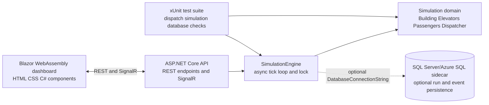

# Elevator Dispatch Workshop – Hands-On Lab

A hands-on GitHub Copilot workshop for building and extending a real-time elevator dispatch simulation. The lab uses a C# ASP.NET Core backend, a Blazor WebAssembly dashboard, an optional SQL Server persistence path, and repository-level Copilot customizations so participants can practice prompts, skills, instructions, and iterative application changes on a small but realistic codebase.

> Pre-work: complete setup before the workshop session begins so you can spend the session building, testing, and using Copilot rather than installing tools.

## Prerequisites

### Must-Have Now

| Requirement | Notes |
| --- | --- |
| GitHub account | Required to fork or clone the repository. |
| GitHub Copilot access | Individual, Business, Enterprise, or another plan enabled by your organization. |
| VS Code | Latest stable release with GitHub Copilot and GitHub Copilot Chat enabled. |
| Git | Configured with your GitHub credentials. |

### Additional Tools by Path

| Path | Tools |
| --- | --- |
| GitHub Codespaces | No local runtime install required. The devcontainer installs .NET SDK 10.0+, Aspire CLI, Docker, Azure CLI, azd, Bicep, and MCP Inspector support. |
| VS Code + Dev Containers | Docker Desktop or a compatible container engine, plus the VS Code Dev Containers extension. |
| Manual setup | .NET SDK 10.0+, Git, and optionally SQL Server or Azure SQL access. |

### Permissions and Licensing

Most labs work with any GitHub Copilot license and repository write access. Labs that use GitHub Actions, Copilot coding agent, or organization-managed Copilot features may require permissions from your GitHub organization administrator.

If your organization restricts Copilot agent mode, MCP servers, Codespaces, or GitHub Actions by policy, confirm access before the workshop.

## Choose Your Path

| Path | Time | Best For | Recommendation |
| --- | --- | --- | --- |
| Codespaces | 5-10 min | In-person workshops and zero local install | Start here |
| VS Code + Docker Desktop | ~15 min | Developers already using containers locally | Supported |
| Manual setup | ~20 min | Developers who prefer direct local installs | Advanced |

### Option A – GitHub Codespaces

1. Fork this repository or open your assigned workshop copy.
2. Select **Code** > **Codespaces** > **Create codespace on main**.
3. Wait for the container to build. The first build can take several minutes while features and dependencies install.
4. Verify the core tools:

   ```bash
   dotnet --version
   gh --version
   docker --version
   ```

5. Run the validation commands in [Verify the Application](#verify-the-application).

### Option B – VS Code + Docker Desktop

1. Install Docker Desktop and start it.
2. Install the VS Code Dev Containers extension.
3. Fork and clone this repository.
4. Open the repository folder in VS Code.
5. When prompted, choose **Reopen in Container**, or run **Dev Containers: Reopen in Container** from the Command Palette.
6. Wait for the devcontainer to build, then run the validation commands below.

### Option C – Manual Setup

Manual setup is useful when you cannot use Codespaces or a devcontainer. Install .NET SDK 10.0+, Git, and optionally SQL Server or Azure SQL.

```bash
dotnet --version
git --version
```

Restore NuGet dependencies:

```bash
dotnet restore
```

## Verify the Application

Run these commands from the repository root:

```bash
dotnet build
dotnet test src/ElevatorTests --verbosity normal
dotnet run --project src/ElevatorAppHost
```

Open the Aspire dashboard URL provided (typically `http://localhost:17043`) to view the live elevator dashboard.

## The Application

The application simulates a 5-floor building with 4 elevators. A simple dispatcher assigns passengers to the nearest compatible elevator, while an ASP.NET Core API exposes REST endpoints and a SignalR hub. The Blazor WebAssembly dashboard renders live elevator cabs, passenger dots, floor metadata, movement totals, queued passengers, and average wait time. When `DatabaseConnectionString` is configured, the server also writes simulation run metadata and passenger lifecycle events to SQL Server without changing the dashboard experience.



| Area | Responsibility | Location |
| --- | --- | --- |
| API | ASP.NET Core routes, request validation, database helpers, SignalR hub | `src/ElevatorApi/` |
| Simulation | Building, elevators, passengers, dispatcher, tick lifecycle | `src/ElevatorSimulation/` |
| UI | Blazor WebAssembly components, CSS, interactivity | `src/ElevatorUI/Components/` |
| Tests | xUnit test suite for dispatcher, simulation, and database behavior | `src/ElevatorTests/` |
| Devcontainer | Codespaces runtime, Docker-in-Docker, SQL Server sidecar, tooling | `.devcontainer/` |
| Copilot customization | Prompts, skills, agents, path-specific instructions | `.github/` |

## Dashboard target state

Use this screenshot as the target state for the live
dashboard layout.


## What You Will Learn

| Topic | Practice |
| --- | --- |
| Copilot instructions | Use repository and path-specific instructions to guide code generation. |
| Prompt files | Run reusable `.prompt.md` workflows for setup and feature changes. |
| Skills | Package repeatable procedures, such as SQL Server schema inspection, as `SKILL.md` assets. |
| ASP.NET Core | Add validated REST endpoints and SignalR hub behavior. |
| Blazor WebAssembly | Build interactive components with C# and real-time updates. |
| Simulation design | Extend a small domain model with explicit state transitions. |
| Async C# patterns | Use `SemaphoreSlim`, `TaskCompletionSource`, and background services. |
| Devcontainer tooling | Work with Codespaces, Docker-in-Docker, SQL Server, Azure tooling, Terraform, and Bicep. |
| Verification loops | Run compile, unit test, and database inspection checks after changes. |

## Lab Modules

| Module | Focus | Outcome |
| --- | --- | --- |
| Setup | Fork, Codespaces, prerequisites, validation | A working development environment. |
| Lab 01 | Initialize the elevator dispatch app | Baseline ASP.NET Core app with Blazor dashboard and tests. |
| Lab 02 | Add SQL Server and persistence labs | Compose sidecar, init schema, event persistence, and table reset workflows. |
| Lab 03 | Use GitHub metadata and PR review workflows | Issue type discovery plus Review-agent prompts for small UI PRs. |
| Lab 04 | Prepare Azure migration guidance | Azure deployment instructions and migration prompt scaffolding. |
| Future labs | Basement support, analytics, deployment implementation, and richer dispatch experiments | Incremental extensions driven by prompts, PRDs, and tests. |

### Lab Progress

This checklist follows the numeric prompt sequence in `.github/prompts/` so participants can see which reusable workflows have been authored or completed.

- [x] `00.00`: Create meta/update README and PRD prompt assets for maintaining workshop documentation.
- [x] `01.00`: Initialize the ASP.NET Core elevator dispatch app, Blazor dashboard, simulation modules, and tests.
- [x] `01.01`: Create the README task-list workflow that anchors the lab sequence.
- [x] `02.00`: Add the SQL Server devcontainer sidecar, init schema, and optional database engine bootstrap.
- [x] `02.01`: Add cloud and modernization tooling to the devcontainer.
- [x] `02.02`: Add a Coding Agent prompt for GitHub Copilot CLI/devcontainer feature work.
- [x] `02.03`: Persist simulation runs and passenger lifecycle events to SQL Server when `DatabaseConnectionString` is set.
- [ ] `02.04`: Optional Coding Agent exercise to add a basement level and update the Blazor component animation.
- [x] `02.05`: Add a reset-all-tables prompt that verifies tables, queries records, deletes rows, and validates counts.
- [x] `02.06`: Reset SQL Server tables whenever the UI **Restart simulation** flow calls `POST /api/restart`.
- [x] `03.00`: List repository-supported GitHub issue types through MCP.
- [x] `03.01`: Add GitHub Copilot Review-agent prompt variants for reviewing ev-02 and ev-04 cab color PRs.
- [x] `04.00`: Establish Azure deployment custom instructions scoped to `src/**`.
- [ ] `04.01`: Expand the Azure migration prompt into an executable deployment lab.
- [ ] Future: Add dashboard analytics for run history and dispatch performance.

## Completed Reference Solution

During lab demonstrations, facilitators may move the current `src/` contents into a top-level `completed/` folder and then rebuild the app in a fresh, empty `src/` by running the indexed prompts in sequence. The `completed/` folder is intended to act as a facilitator reference solution and is excluded from repository-level Copilot context so participants practice rebuilding from prompts, instructions, tests, and visible documentation instead of copying the finished app.

Keep these caveats in mind:

- Treat `completed/` as a reference snapshot, not an implementation source for Copilot during rebuild labs.
- Content exclusion controls Copilot context; it is not a filesystem or Git security boundary.
- Expect functionally equivalent rebuilt code rather than byte-for-byte identical output.
- Validate after each prompt or lab cluster with `dotnet build`, `dotnet test`, and an app smoke test.
- Reset SQL Server tables or volumes when a clean database state is needed for the rebuilt workspace.

## Pre-Configured Copilot Features

| Feature | Location | Notes |
| --- | --- | --- |
| Repository instructions | `.github/copilot-instructions.md` | Project structure, architecture, C#, Blazor, PRD, and change-discipline rules. |
| Path instructions | `.github/instructions/` | C#, xUnit, and Azure deployment conventions. |
| Prompt files | `.github/prompts/` | Reusable lab workflows for initialization, SQL Server, GitHub issue metadata, PR review, and Azure migration. |
| Skills | `.github/skills/` | SQL Server devcontainer setup, schema inspection, and data persistence workflows. |
| Agents | `.github/agents/` | Documentation and Markdown lint/edit helpers. |

## Useful Commands

| Task | Command |
| --- | --- |
| Restore NuGet packages | `dotnet restore` |
| Build solution | `dotnet build` |
| Run all tests | `dotnet test src/ElevatorTests --verbosity normal` |
| Run specific test file | `dotnet test src/ElevatorTests/DispatcherTests.cs` |
| Run with coverage | `dotnet test --settings src/ElevatorTests/coverage.runsettings --collect:"XPlat Code Coverage"` |
| Start Aspire dashboard | `dotnet run --project src/ElevatorAppHost` |
| Start with SQL Server persistence | Set `DatabaseConnectionString` environment variable before running |
| List available projects | `dotnet sln list` |
| Inspect SQL Server schema | `.github/skills/sql-schema-inspection/scripts/inspect-sql-schema.sh` |
| Connect with sqlcmd | `sqlcmd -S localhost -U sa -P YourPassword -d ElevatorDispatch` |
| Count persisted rows | `sqlcmd -S localhost -U sa -P YourPassword -d ElevatorDispatch -Q "SELECT event_type, COUNT(*) FROM passenger_events GROUP BY event_type;"` |

## Repository Structure

```text
elevator-dispatch/
├── .devcontainer/                    # Codespaces and devcontainer configuration
│   ├── devcontainer.json
│   └── docker-compose.yml            # SQL Server sidecar orchestration
├── .github/
│   ├── agents/                       # Custom Copilot agent profiles
│   ├── instructions/                 # Path-specific instructions
│   ├── prompts/                      # Reusable prompt workflows, numbered by lab sequence
│   ├── skills/                       # Project skills and script artifacts
│   └── copilot-instructions.md       # Repository-wide Copilot instructions
├── docs/                             # PRDs and reference images
├── completed/                        # Excluded facilitator reference solution, when populated
├── infra/                            # Infrastructure as Code (Bicep, Terraform)
├── src/
│   ├── ElevatorApi/                  # ASP.NET Core API with REST endpoints and SignalR hub
│   ├── ElevatorAppHost/              # Aspire AppHost orchestration
│   ├── ElevatorServiceDefaults/      # Aspire service defaults and extensions
│   ├── ElevatorSimulation/           # Elevator dispatch domain model
│   ├── ElevatorTests/                # xUnit test suite, including database helper tests
│   └── ElevatorUI/                   # Blazor WebAssembly dashboard and components
├── ElevatorDemo.slnx                 # Solution file
├── azure.yaml                        # Azure Developer CLI configuration
└── README.md
```

## SQL Server Sidecar

The devcontainer includes a SQL Server 2022 sidecar for persistence and analytics labs. The simulation still keeps live state in memory, but the ASP.NET Core app can write run metadata and passenger lifecycle events to SQL Server when `DatabaseConnectionString` is set. Clicking **Restart simulation** clears the application tables before creating the fresh run row.

Default connection string:

```text
Server=localhost;Database=ElevatorDispatch;User Id=sa;Password=YourPassword;Encrypt=false;
```

Inspect the initialized schema:

```bash
.github/skills/sql-schema-inspection/scripts/inspect-sql-schema.sh
```

Expected tables:

- `SimulationRuns`
- `PassengerEvents`
- `Scenarios`

Runtime behavior:

- `SimulationRuns` records run metadata, including dispatcher strategy, tick interval, spawn chance, totals, and wait time aggregates.
- `PassengerEvents` records `Created`, `Assigned`, `Boarded`, and `Exited` events.
- `Scenarios` is reserved for future replay and analytics labs.
- `POST /api/restart` deletes records from `PassengerEvents`, `Scenarios`, and `SimulationRuns`, then creates a fresh run row when persistence is enabled.

## Troubleshooting

| Symptom | Try This |
| --- | --- |
| Codespace opens in recovery mode | Review the creation log, then check recent `.devcontainer/` feature changes. |
| .NET SDK is missing | Rebuild the devcontainer so the .NET feature is installed, or install .NET SDK 10.0+ for manual setup. |
| SQL Server tables are missing | Recreate the SQL Server volume or apply `.devcontainer/sql-init/001-schema.sql`; init scripts run only when the volume is first created. |
| Passenger events are not written | Start Aspire with `DatabaseConnectionString=Server=localhost;Database=ElevatorDispatch;User Id=sa;Password=YourPassword;Encrypt=false;`. |
| Tables repopulate after reset | Stop or pause the running app, or remember that the simulation may immediately write a fresh run or new passenger events after restart. |
| Port 17043 is already in use | Aspire automatically assigns an alternate port and reports it in console output. |
| UI changes are not reflected | Rebuild the Blazor project and refresh the browser; clear cache if needed. |
| Build fails with NuGet errors | Run `dotnet restore` to ensure all packages are installed. |
| Tests fail unexpectedly | Run `dotnet clean` followed by `dotnet build` to reset build artifacts. |

## Deployment with Azure Developer CLI

This repo now supports `azd up` for provisioning and deploying the web workload (`src/ElevatorApi`) to Azure App Service.

- AZD project file: `azure.yaml`
- Setup and command guide: [`.azure/readme.md`](.azure/readme.md)

## GitHub Actions Deployment

This repository includes automated GitHub Actions workflows for deploying the application to Azure. For detailed setup and usage instructions, see [`.github/workflows-readme.md`](.github/workflows-readme.md).

Quick start:
- Set up Azure OIDC secrets (`AZURE_CLIENT_ID`, `AZURE_TENANT_ID`, `AZURE_SUBSCRIPTION_ID`) in GitHub
- Run the **2.1 - Deploy Bicep/Build & Deploy Web App** workflow from the Actions tab
- Or deploy infrastructure only with the **1 - Deploy Bicep** workflow

## Contributing

Keep application code under `src/`. Product requirements documents belong in `docs/` and should use the `prd-*.md` naming pattern. Custom Copilot prompts, skills, instructions, and agents belong under `.github/`.

Before opening a pull request or handing off work, run the relevant validation commands and summarize any checks that could not be run in the current environment.

## License

See [LICENSE](LICENSE).
