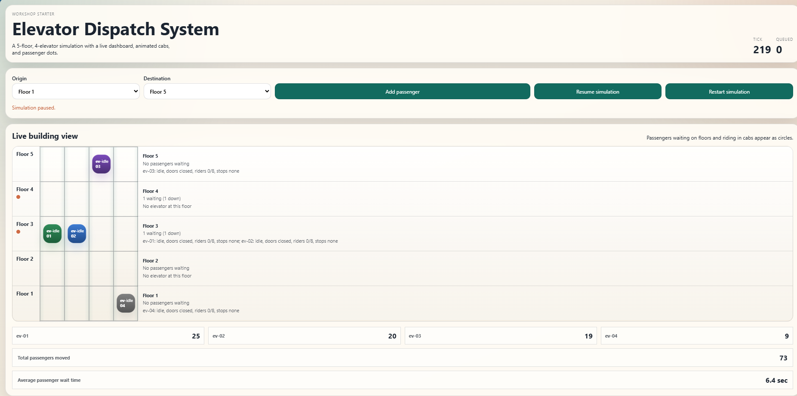

# Elevator Dispatch Workshop

A GitHub Copilot workshop project that simulates a 5-floor,
4-elevator dispatch system with a real-time web dashboard.

## Lab tasks

## What it does

The application under `src/` runs an in-memory elevator
simulation driven by a simple dispatcher heuristic. A dashboard renders the live building view with
animated elevator cabs, passenger dots, floor-level metadata,
per-cab movement totals, and average passenger wait time.

## Dashboard target state

Use this screenshot as the target state for the live
dashboard layout.



## Project layout

```text
├── docs/             # PRDs (prd-*.md) and images
└── src/
    ├── api/          # API routes, WebSocket,
    │                 # Pydantic models
    ├── simulation/   # Domain model: building,
    │                 # elevators, passengers,
    │                 # dispatcher, engine
    ├── tests/        # unittest-based test suite
    └── ui/           # HTML template, TypeScript
                      # source, served static assets
```

## Getting started

All commands run from the `src/` directory.

Start the app:

```bash
dotnet run
```
Open the dashboard URL provided (typically `http://localhost:17043` for Aspire dashboard).

## Deployment with Azure Developer CLI

This repo now supports `azd up` for provisioning and deploying the web workload (`src/ElevatorApi`) to Azure App Service.

- AZD project file: `azure.yaml`
- Setup and command guide: [`.azure/readme.md`](.azure/readme.md)

## Contributing

Custom Copilot prompts live in `.github/prompts/`.
Custom Copilot agents live in `.github/agents/`.
Product requirements documents go in `docs/` using
the naming pattern `prd-document-name.md`.
Repository-level Copilot instructions are in
`.github/copilot-instructions.md`. Follow those
conventions when extending the project through new
lab steps.
